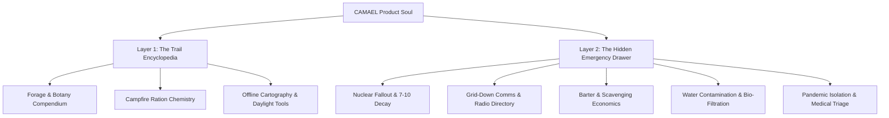
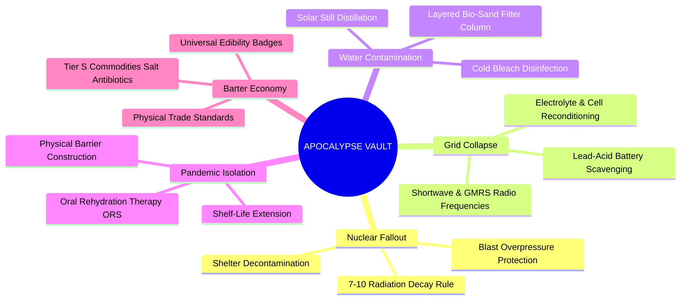

# CAMAEL — Phase 1: Narrative & Strategic Objectives
**Product Class:** Offline Field Encyclopedia & Tactical Survival Multi-Tool  
**Creative Director:** NIFT Hyderabad (Fashion Communication)  
**Technical Architect:** Antigravity  

---

## 1. Executive Summary & Brand Soul
**CAMAEL** (*Guardian of Strength, Courage, and Justice*) is a zero-latency, 100% offline survival encyclopedia and tactical multi-tool. Engineered for backpackers, thru-hikers, wild campers, and off-grid nomads, CAMAEL marries the curated, minimalist visual language of modern technical gear with the unyielding utility of a physical Swiss Army Knife.

---

## 2. Product Duality Architecture

| Parameter | Surface Layer: The Field Encyclopedia | Sub-Surface Layer: The Hidden Emergency Drawer |
| :--- | :--- | :--- |
| **Primary Context** | Mindful hiking, camp planning, trail foraging, orientation. | Catastrophic crisis, sudden poisoning, biological/nuclear disaster, grid collapse. |
| **Tone of Voice** | Objective, encyclopedic, calm, authoritative, scientifically rigorous. | High-urgency, imperative, structured checklist (*First 60s &rarr; 1 Hour &rarr; 24 Hours*). |
| **UI Paradigm** | Grid-based taxonomy, bartering tiers, scientific nomenclature. | High-contrast emergency state, tactile controls, audio metronome HUD. |
| **Cognitive Load** | Exploratory & educational (low stress). | Minimal, zero-distraction decision trees (extreme stress / 80% cognitive impairment). |

---

## 3. Core Jobs-to-be-Done (JTBD) Matrix

The entire Information Architecture of CAMAEL is built to answer three immediate questions in under 5 seconds, even in complete darkness or sub-zero temperatures:

### Job 1: *"Is what I just ate poisonous?"*
* **Trigger:** Forager ingests unknown berry/mushroom or experiences sudden stomach distress.
* **CAMAEL System Response:**
  * 1-Tap access to **Scavenger's Compendium** with instant visual red-flag warnings (Death Cap, Hemlock, Nightshade).
  * Direct one-click routing to **Activated Charcoal Poisoning Slurry** and Universal Edibility Test (UET) protocol.

### Job 2: *"What should I do in [XYZ] critical situation?"*
* **Trigger:** Partner goes unresponsive, a fracture occurs, or a flash of light / severe weather strikes.
* **CAMAEL System Response:**
  * **"In Case Of..." Emergency Drawer** delivers bulleted 60-second action items before panic sets in.
  * Standalone physical tools: 110 BPM Web Audio CPR metronome, Morse transceiver, Radiation decay clock.

### Job 3: *"Where am I and how much time do I have?"*
* **Trigger:** Disorientation on unfamiliar terrain with dying light or zero satellite connectivity.
* **CAMAEL System Response:**
  * Offline vector topological world map with coordinate grids and custom cacheable waypoints.
  * **The Four-Fingers Rule** manual for instant celestial daylight calculation without digital sensors.

---

## 4. Apocalypse Preparedness Modules (Non-Negotiable Scenarios)

---

## 5. Technical Constraints & Design Principles
1. **100% Offline-First:** Zero external CDN calls, zero analytics, zero APIs. All data bundles, maps, audio synthesizers, and vector graphics live locally in the app bundle.
2. **Minimalist Modernist Grid:** Pitch-black background (`#080808`), hairline 1px structural borders (`#222222`), ultra-crisp monospaced metadata and clean sans-serif editorial body typography.
3. **No Fluff / High Density:** High information density per square inch without visual clutter. Prioritize scanability and instant legibility in direct sunlight or dim tent lighting.
