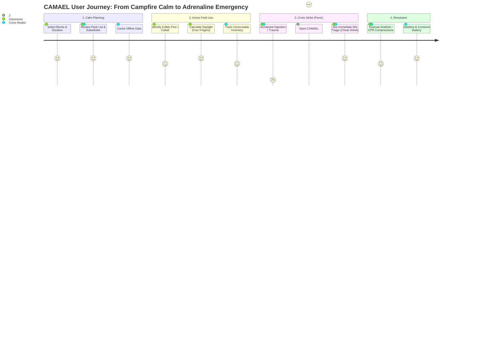

# CAMAEL — Phase 2: Empathy & User Experience Modeling
**Product Class:** Offline Field Encyclopedia & Tactical Survival Multi-Tool  
**Creative Director:** NIFT Hyderabad (Fashion Communication)  
**Technical Architect:** Antigravity  

---

## 1. User Archetypes & Behavioral Models

### Archetype A: The Adventurer (The Mindful Thru-Hiker & Camper)
* **Demographics & Mindset:** 20–35, design-conscious outdoor enthusiast, ultralight backpacker, weekend trail camper.
* **Core Need:** Preparation confidence, destination-specific pack planning, forage identification, and peace of mind.
* **Key Frustration:** Outdoor apps bloated with social media feeds, constant subscription paywalls, and uselessness the moment 4G/5G drops.
* **CAMAEL Touchpoint:**
  * **Dynamic Gear Recommendation Engine:** Suggests pack loadouts tailored to biome (Alpine, Wetland, Forest, Arid) and trip duration (Overnight, 3-Day, Extended Off-Grid).
  * **Item Substitutions Matrix:** Provides accessible alternatives if specialized gear is missing (e.g., No water filter &rarr; Sand/Charcoal column or 2 drops unscented bleach).

### Archetype B: The Crisis Realist (The Off-Grid Prepper & Survivalist)
* **Demographics & Mindset:** Pragmatic self-reliance practitioner, off-grid homesteader, emergency preparedness planner.
* **Core Need:** Systematic inventory control, worst-case disaster triage, scavenging prioritization, and barter valuations.
* **Key Frustration:** Prepper manuals that are paranoid, disorganized, hard to read in the dark, or lack verifiable clinical/scientific rigor.
* **CAMAEL Touchpoint:**
  * **Survival Inventory & Consumption Tracker:** Monitors essential reserves (water, calories, iodine/tablets, batteries) and alerts before critical depletion.
  * **Barter & Scavenging Hierarchy:** Classifies finds by intrinsic trade value and survival utility (Tier S to Tier D).

---

## 2. Emotional & Cognitive Journey Map: Calm vs. Crisis

---

## 3. Cognitive UX Under Extreme Environmental Stress

The user describes opening CAMAEL in a crisis as **"finding a cheat sheet during an exam."**

| Environmental Stressor | Physiological & Cognitive Impact | CAMAEL UX & Engineering Countermeasure |
| :--- | :--- | :--- |
| **Wet Hands / Torrential Rain** | Capacitive touchscreen false taps, loss of fine motor skills. | Oversized 48px+ tactile targets; vertical swipe gestures; single-tap glance cards; optional local speech audio cues. |
| **Dying Battery (&lt; 5%)** | High anxiety; system shutdown imminent within minutes. | **Ultra-Battery Reserve Mode:** 100% OLED pitch black (`#000000`), zero CSS animations, frozen background loops, minimal monospaced text hierarchy. |
| **Pitch Black / Tent Darkness** | Blinding glare from white screens, ruined night vision. | Pure dark mode default, high-contrast amber/monochrome accents, night-vision red filter option. |
| **Panic & Cognitive Tunneling** | 80% loss in reading comprehension; inability to process paragraphs. | **Triage Bullet Hierarchy:** Single imperative sentences (`"COMPRESS 2 INCHES DEEP"`, `"DO NOT INDUCE VOMITING"`). |

---

## 4. Key Feature Scaffolding for Upcoming Phases
1. **Gear & Loadout Recommender:** Biome + Duration generator with built-in item fallback substitutions.
2. **Inventory Vault:** Offline tracking of rations, medical supplies, and tool status with depletion warnings.
3. **Ultra-Reserve Display Mode:** One-tap battery-saver toggle stripping all non-essential UI.
