# CAMAEL — Phase 3: Information Architecture & Taxonomy Specification
**Product Class:** Offline Field Encyclopedia & Tactical Survival Multi-Tool  
**Creative Director:** NIFT Hyderabad (Fashion Communication)  
**Technical Architect:** Antigravity  

---

## 1. System Navigation Architecture

CAMAEL utilizes a **Persistent Dual-Tier Navigation Model**:
1. **Tier 1 (Surface Navigation):** 4 core tabs for planning, navigation, and field study.
2. **Tier 2 (High-Priority SOS Override):** A persistent `[⚡ SOS CHEAT SHEET]` pill in the header providing instant access to crisis protocols and Ultra-Reserve battery mode.

```mermaid
graph TD
    Root["CAMAEL Interface Shell"]
    
    %% Header Override
    Root --> SOS["[⚡ SOS CHEAT SHEET] Header Pill"]
    SOS --> D1["Crisis Playbooks (Cardiac, Trauma, Fallout, Bleed)"]
    SOS --> D2["Instant Lifesavers (ORS & Charcoal Slurry)"]
    SOS --> D3["Tactical CPR Metronome (110 BPM)"]
    SOS --> D4["Ultra-Battery Reserve Mode Toggle"]

    %% Core Navigation
    Root --> Tab1["1. COMPENDIUM"]
    Root --> Tab2["2. MAP"]
    Root --> Tab3["3. GEAR & VAULT"]
    Root --> Tab4["4. FIELD MANUAL"]

    %% Tab Contents
    Tab1 --> C1["Botanical & Forage Encyclopedia"]
    Tab1 --> C2["Toxicity Warnings & Red Flags"]
    Tab1 --> C3["Barter Value Badges (Tier S to D)"]
    Tab1 --> C4["Universal Edibility Test (UET)"]

    Tab2 --> M1["Offline Vector World Map"]
    Tab2 --> M2["Coordinate Grids & Lat/Long HUD"]
    Tab2 --> M3["Custom Waypoint Plotter & Storage"]

    Tab3 --> G1["4-Gauge Telemetry (Water, Med, Food, Fuel)"]
    Tab3 --> G2["Trip Gear Planner (Biome x Duration x Group)"]
    Tab3 --> G3["Inventory Checklist & Item Substitutes"]
    Tab3 --> G4["Emergency ICE Medical Vault"]

    Tab4 --> F1["Visual How-To SVG Blueprints"]
    Tab4 --> F2["Four-Fingers Daylight Calculator"]
    Tab4 --> F3["Bio-Sand Water Purification Column"]
    Tab4 --> F4["Radio Directory & Morse Code Transceiver"]
```



---

## 2. Inventory & Trip Planning Taxonomy Schema

### The 4-Gauge Survival Telemetry
The top of the `GEAR & VAULT` tab houses 4 critical resource gauges:

| Gauge Metric | Unit of Measurement | Depletion Alert Threshold | Direct Mitigation Link |
| :--- | :--- | :--- | :--- |
| **💧 Water Reserves** | Liters ($L$) | $&lt; 2.0\text{ L / person / day}$ | Bio-Sand Filtration Guide / Cold Bleach Purifier |
| **🩹 Medical Supplies** | Trauma Units (Dressings/Antiseptic) | $&lt; 2\text{ Sterile Packs}$ | Field Dressing Manual / Antibiotic Preservation |
| **🍲 Food / Calories** | Rations / Days of Sustenance | $&lt; 1,500\text{ kcal / person / day}$ | Forage Compendium / High-Calorie Rations |
| **⚡ Fuel & Power** | Stored Watts ($Wh$) / Gas ($g$) | $&lt; 20\%\text{ Remaining}$ | Ultra-Battery Reserve / Lead-Acid Battery Scavenging |

---

### The Trip Planner Vector Equation
The Gear Generator calculates recommended loadouts based on 4 variables:
$$\text{Pack Recommendation} = f(\text{Biome}, \text{Terrain}, \text{Duration}, \text{Party Size})$$

* **Biome:** Forest & Woodland | Wetland & Freshwater | Urban & Industrial | Coastal & Maritime | Arid & Grassland
* **Terrain Difficulty:** Marked Trail | Off-Grid Wilds | Alpine / High-Elevation | Submerged / Floodplain
* **Duration:** Day Trek ($&lt; 12\text{ hrs}$) | Overnight ($24\text{ hrs}$) | Multi-Day ($3–5\text{ days}$) | Extended Grid-Down ($7+\text{ days}$)
* **Party Size:** Solo ($1$) | Duo ($2$) | Small Team ($3–5$) | Expedition ($6+$)

---

### Fallback & Substitute Architecture (Example Data Model)

```json
{
  "item_id": "gear_water_purifier",
  "name": "Microbiological Hollow-Fiber Filter",
  "category": "hydration",
  "essential_rating": "MANDATORY",
  "base_quantity_per_person": "1 Unit",
  "substitutes": [
    {
      "tier": "Standard Fallback",
      "name": "Unscented Household Bleach (Sodium Hypochlorite)",
      "dosage": "2 drops per 1L clear water (wait 30 min)",
      "acquisition": "Residential laundry caches, convenience stores"
    },
    {
      "tier": "Improvised Fieldcraft",
      "name": "Layered Bio-Sand & Charcoal Filter Column",
      "method": "Coarse gravel -> fine sand -> crushed charcoal -> cotton cloth",
      "source_manual_id": "guide_bio_filter"
    }
  ]
}
```
