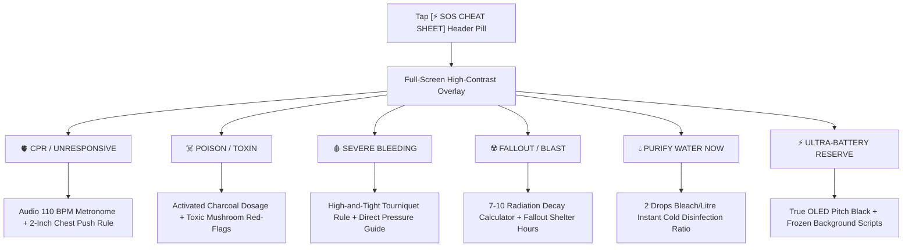

# CAMAEL — Phase 4: User Flows & Structural Wireframes
**Product Class:** Offline Field Encyclopedia & Tactical Survival Multi-Tool  
**Creative Director:** NIFT Hyderabad (Fashion Communication)  
**Technical Architect:** Antigravity  

---

## 1. System Navigation Layout: The "Swiss Index" Slide-Out Drawer

To preserve all 7 core modules without crowding the screen or relying on cluttered icon bars, CAMAEL employs a clean **Slide-Out Navigation Drawer ("The Swiss Index")** alongside the persistent **`[⚡ SOS CHEAT SHEET]`** header pill.

```
+-----------------------------------------------------------------------+
| [= INDEX]   C A M A E L  //  FIELD DIRECTORY     [⚡ SOS CHEAT SHEET] |
+-----------------------------------------------------------------------+
|                                                                       |
|   +--------------------------+                                        |
|   | 01. COMPENDIUM           |                                        |
|   | 02. FIELD MAP            |                                        |
|   | 03. GEAR & VAULT         |  <- Clean, vertical Monospaced Index   |
|   | 04. SURVIVAL KITCHEN     |     Slides smoothly from left or top   |
|   | 05. FIELD MANUAL         |     Numbered 01 to 07                  |
|   | 06. RADIO & COMMS        |                                        |
|   | 07. ICE LOGBOOK          |                                        |
|   +--------------------------+                                        |
|                                                                       |
+-----------------------------------------------------------------------+
```

---

## 2. Crisis User Flow: The Full-Screen SOS Overlay ("The Cheat Sheet")



### SOS Full-Screen Overlay Wireframe
```
+=======================================================================+
| [X CLOSE]           ⚡ CRITICAL EMERGENCY CHEAT SHEET        [BAT: 4%] |
+=======================================================================+
|  [⚡ TOGGLE ULTRA-BATTERY RESERVE: 100% OLED BLACK // CPU THROTTLED]   |
+-----------------------------------------------------------------------+
|                                                                       |
|  +--------------------------------+  +--------------------------------+
|  | 🫀 CPR / UNRESPONSIVE          |  | ☠️ POISON / INGESTION          |
|  | [START 110 BPM METRONOME]      |  | [CHARCOAL SLURRY DOSAGE]       |
|  +--------------------------------+  +--------------------------------+
|                                                                       |
|  +--------------------------------+  +--------------------------------+
|  | 🩸 SEVERE BLEEDING             |  | ☢️ NUCLEAR / FALLOUT           |
|  | [TOURNIQUET & PRESSURE RULE]   |  | [7-10 DECAY CALCULATOR]        |
|  +--------------------------------+  +--------------------------------+
|                                                                       |
|  +--------------------------------+  +--------------------------------+
|  | 💧 PURIFY WATER NOW            |  | 📻 EMERGENCY BROADCAST         |
|  | [2 DROPS BLEACH / LITRE]       |  | [MAYDAY VHF CH 16 / 121.5 MHz] |
|  +--------------------------------+  +--------------------------------+
|                                                                       |
|  FIRST 60 SECONDS PROTOCOL DISPLAYED DIRECTLY BELOW SELECTED TARGET    |
+=======================================================================+
```

---

## 3. Gear & Vault: Structural Wireframe (Readout Cards + Accordion Alts)

```
+-----------------------------------------------------------------------+
| GEAR & VAULT // RESOURCE TELEMETRY & TRIP PLANNER                     |
+-----------------------------------------------------------------------+
|                                                                       |
|  +---------------+ +---------------+ +---------------+ +------------+
|  | 💧 WATER      | | 🩹 MEDICAL    | | 🍲 CALORIES   | | ⚡ POWER    |
|  | 6.5 L         | | 4 UNITS       | | 3.5 DAYS      | | 84% / 42Wh  |
|  | STABLE        | | CRITICAL LOW  | | RATIONED      | | SOLAR OK    |
|  +---------------+ +---------------+ +---------------+ +------------+
|                                                                       |
+-----------------------------------------------------------------------+
| TRIP LOADOUT GENERATOR                                                |
| [ BIOME: Wetland  v ] [ LOCATION: Floodplain ] [ DURATION: 3 Days v ]  |
| [ PARTY SIZE: 2 Persons v ]                     [ GENERATE LOADOUT ]  |
+-----------------------------------------------------------------------+
|                                                                       |
| RECOMMENDED PACK LIST (TAP CARD TO EXPAND ACCORDION FOR SUBSTITUTES)  |
|                                                                       |
| +-------------------------------------------------------------------+ |
| | [v] WATER PURIFICATION SYSTEM                 [MANDATORY / TIER S]| |
| |     Recommended: Micro Hollow-Fiber Pump Filter                   | |
| |     ------------------------------------------------------------- | |
| |     [EXPANDED FALLBACK SUBSTITUTES]:                              | |
| |     > [ALT 1]: Unscented Household Bleach (2 drops/L, wait 30m)   | |
| |     > [ALT 2]: Bio-Sand & Crushed Charcoal Gravity Column         | |
| |     > [ALT 3]: Rolling Boil for 3 Full Minutes (100°C)            | |
| +-------------------------------------------------------------------+ |
|                                                                       |
| +-------------------------------------------------------------------+ |
| | [ ] SHELTER: ULTRALIGHT SIL-NYLON TARP       [CRITICAL / TIER A]  | |
| |     Recommended: 3x3m 20D Waterproof Sil-Nylon Tarp               | |
| |     > [TAP TO REVEAL EMERGENCY SUBSTITUTES: Debris Hutch / Poncho]| |
| +-------------------------------------------------------------------+ |
+-----------------------------------------------------------------------+
```
